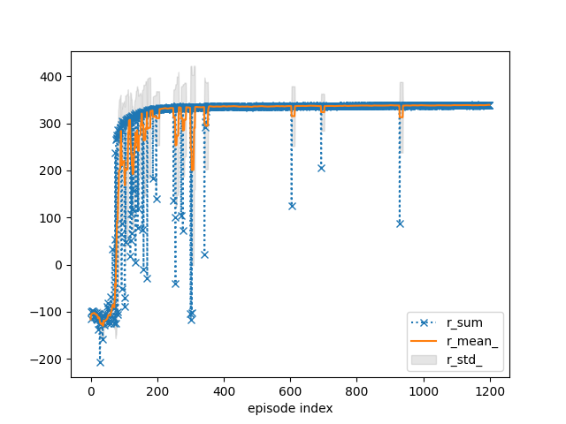
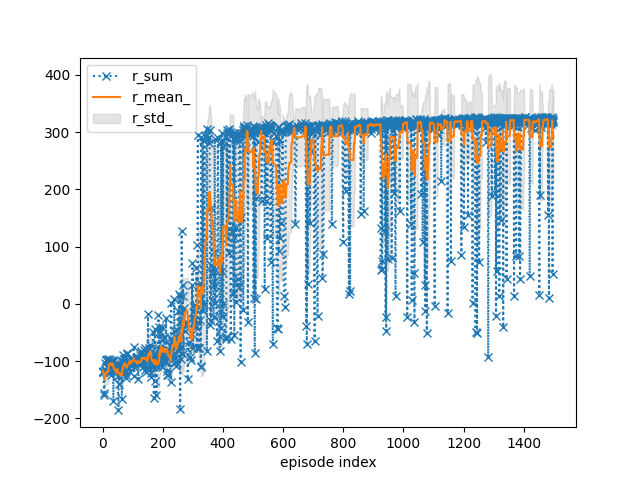
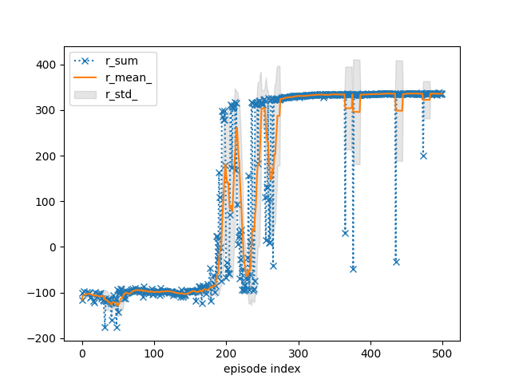
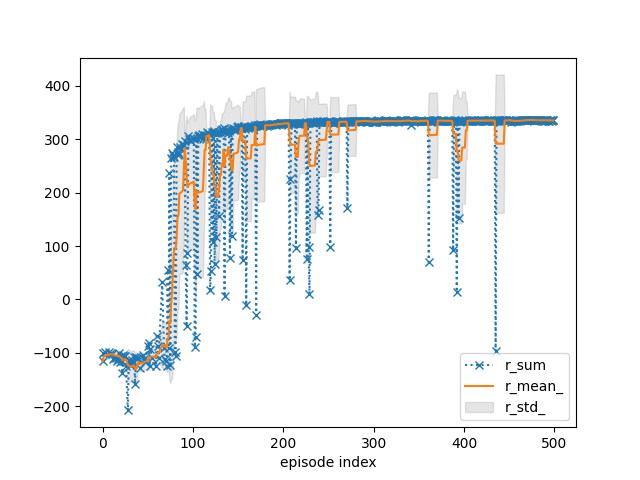
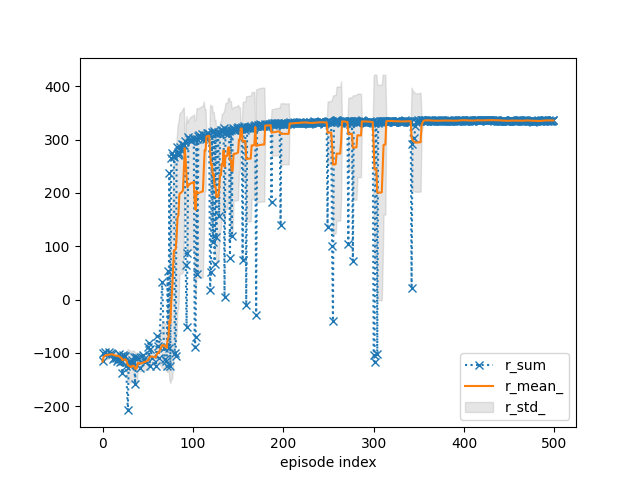

# Reinforcement-Learning Project

# Sample-Efficient Bipedal Walker Learning with TD7

Implementation of the **TD7** continuous-control reinforcement learning algorithm applied to the Gymnasium `BipedalWalker-v3` environment across both Easy and Hardcore terrain variants.

## Overview

This project presents a sample-efficient continuous-control solution that extends Twin Delayed DDPG (TD3) via the **TD7** algorithm. The agent learns robust locomotion policies for traversing flat ground as well as complex, obstacle-filled terrain (ladders, stumps, and pitfalls).

## Key Features & Methodology

* **State-Action Learned Embeddings (SALE):** Encodes compact joint state-action representations with input clipping to model environment dynamics and reduce extrapolation error.
* **Prioritised Experience Replay (PER):** Samples transitions with high temporal-difference (TD) errors more frequently to focus on information-dense experiences.
* **Custom Exploration Schedule:** Disabling exploration noise after episode 180 significantly improved policy convergence after episode 350.
* **Hyperparameter Optimization:** Tuned using Optuna by maximizing the highest 10-episode rolling reward average.
* **Reproducibility:** All training and evaluation runs use a fixed seed of `42` under identical environment configurations.

## Performance Results

| Environment | Solved Episode | Steps to Solve | Target Score | Max Reward |
| :--- | :--- | :--- | :--- | :--- |
| **BipedalWalker (Easy)** | Episode 95 | 1,184 steps | $\ge 300$ | **339.70** (Ep 1154) |
| **BipedalWalker (Hardcore)** | Episode 346 | 1,188 steps | $\ge 300$ | **324.38** (Ep 1137) |

### Training & Convergence Curves

| Easy Environment (1200 Episodes) | Hardcore Environment (1500 Episodes) |
| :---: | :---: |
|  |  |

* **Easy Environment:** Reaches the target threshold with a score of 305.84 at episode 95 and achieves strong policy stability after episode 360.
* **Hardcore Environment:** Overcomes severe obstacles to solve the environment at episode 346 (score of 306.12) with mean rewards stabilizing between 200–300.

## Experiments & Hyperparameter Tuning

| Untuned Baseline (Easy) | Tuned Baseline (Easy) | Tuned + Exploration Disabled @ Ep 180 |
| :---: | :---: |  :---: |
|  |  |  |

* **Optuna Tuning:** Hyperparameter optimization significantly improved learning speed and stability on the Easy environment.
* **Exploration Cutoff:** Switching exploration noise off completely after episode 180 achieved superior convergence past episode 350 compared to decaying schedules.

---

Note: In compliance with university academic regulations, the source code for this project is maintained in a private repository.
*For the complete write-up, theoretical background, and full benchmark plots, read the paper: [BGilroy-agent-paper.pdf](BGilroy-agent-paper.pdf)
